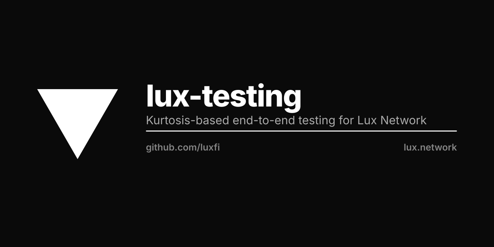

<p align="center"></p>

# Lux Testing

End-to-end testing infrastructure for Lux Network.

## Docker Images

### lux-testing
Main testing container with Kurtosis support.
```bash
docker pull luxfi/lux-testing:master
```

### lux-byzantine
Byzantine fault tolerance testing container.
```bash
docker pull luxfi/lux-byzantine:master
```

## Usage

These images are used by the luxfi/node CI pipeline to run e2e tests.

See [luxfi/node](https://github.com/luxfi/node) for more details.

## License

See LICENSE file.
